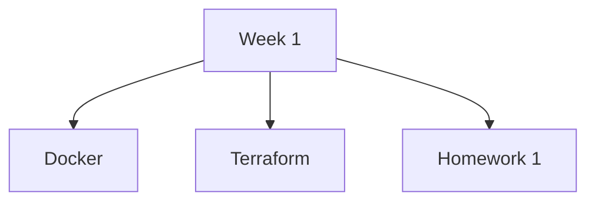

# [DataTalksClub Data Engineering Zoomcamp 2025](https://github.com/DataTalksClub/data-engineering-zoomcamp/tree/main)

### [Homework Cohort 2025](https://github.com/DataTalksClub/data-engineering-zoomcamp/tree/main/cohorts/2025)

## [Week 1](week_1): Docker-Terraform | [Homework 1](week_1/homework.md) | [HW1 Solution](week_1/hw1/hw1_solution.md)

## [Week 2](week_2): Kestra | [Homework 2](week_2/homework.md) | [HW2 Solution](week_2/hw2/hw2_solution.md)

## [Week 3](week_3): Workflow Orchestration | [Homework 3](week_3/homework.md) | [HW3 Solution](week_3/hw3/hw3_solution.md)

## [dlt Workshop](dlt_workshop) | [DLT Homework](dlt_workshop/dlt_homework.md) | [DLT HW Solution](dlt_workshop/hw_dlt/hw_dlt.md)

## [Week 4](week_4): Analytics Engineering | [Homework 4](week_4/homework.md) | [HW4 Solution](week_4/hw4/hw4_solution.md)

## [Week 5](week_5): Batch Processing | [Homework 5](week_5/homework.md) | [HW5 Solution](week_5/hw5/hw5_solution.md)

## [Week 6](week_6): Stream Processing | [Homework 6](week_6/homework.md) | [HW6 Solution](week_6/hw6/hw6_solution.md)

## [Project](project.md)

## Extra Resources
- [Basics of databases](https://tikape.mooc.fi/kevat-2025/tehtavat/) | [SQL Trainer](https://sqltrainer.withmooc.fi/#55)
- [DevOps with Kubernetes](https://devopswithkubernetes.com/)
- [Big Data Platforms 2024](https://big-data-platforms-24.mooc.fi/)
- [Docker](https://docs.docker.com/get-started/) 
- [DevOps with Docker](https://devopswithdocker.com/)
- [Intro to Big Data: IIT Madras](https://www.youtube.com/playlist?list=PLZ2ps__7DhBZYtBcr1ERnw7Y1QGs7bI3y)
- [Kestra Tutorial](https://kestra.io/docs/tutorial)
- [dbt Fundamentals Course](https://learn.getdbt.com/courses/dbt-fundamentals) [My Notes](extra/dbt_fundamentals/README.md)
- [dlt Fundamentals Course](extra/dlthub-education/courses/dlt_fundamentals_dec_2024/README.md)