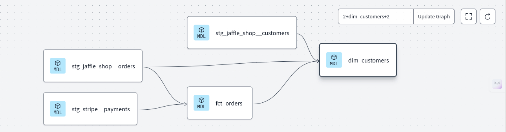

# [dbt Fundamentals](https://learn.getdbt.com/courses/dbt-fundamentals)

### 01. Welcome to dbt Fundamentals 

### 02. Who is an Analytics Engineer?

Traditionally, data teams have been divided into two groups: **data engineers** and **data analysts**. Data engineers are responsible for building and maintaining the infrastructure that enables data analysts to do their work. Data analysts are responsible for querying the data warehouse, building reports, and creating dashboards.

Data engineers are responsible for maintaining data infrastructure and the ETL process for creating tables and views. Skills required:  
- ETL pipelines
- Orchestrating data workflows
- Python, Java, SQL, etc.

Data analysts focus on querying tables and views to drive business insights for stakeholders, skills required:
- Dashboards
- Reports
- Excel, SQL, etc

We have gap between them, Data Analysts knows what needs to be built, DE knows the how to build it, which leads to gap between them. This is where Analytics Engineer comes in.  

**ETL Pipeline**  
- Extract
- Transform
- Load

**ETL and ELT**
- ETL (extract transform load) is the process of creating new database objects by extracting data from multiple data sources, transforming it on a local or third party machine, and loading the transformed data into a data warehouse.
- ELT (extract load transform) is a more recent process of creating new database objects by first extracting and loading raw data into a data warehouse and then transforming that data directly in the warehouse.
- The new ELT process is made possible by the introduction of cloud-based data warehouse technologies.

ETL handeled by DE, require additional tools orchestration, monitoring, cloud based data warehousing, etc. Data Warehouse is the coupling of a database and a supercomputer that run transformation directly in the database - no need to extract and load repeatedly which changes from **ETL** to **ELT**.  

Cloud based data warehouses offers:  
- Scalable compute
- Scalable storage
- Reduction of transfer time
- Transition from ETL to ELT, which leads to Analytics Engineer.

**Analytics Engineering**
- Analytics engineers focus on the transformation of raw data into transformed data that is ready for analysis.
- is sollely responsible for the data transformation, taking raw data and tranforming it, which is the **T** in **ELT**.

Modern Data Team:
- Data Engineer
- Analytics Engineer
- Data Analyst  
  


**dbt**
- dbt empowers data teams to leverage software engineering principles for transforming data.
- allows you to make transofrmation models.


**dbt Cloud IDE**

DAG (Directed Acyclic Graph) is a way to visualize the data transformation:  
- Green Nodes: Source, Tables in my data platform dropped by data loader or pipeline.
- Blude nodes: Models which maps 1-1 with a table or view in the data platform, we build this in dbt.
- Purple nodes: Final model.


```bash
# from left to right in DAG, build the model
dbt run

# test those model as they are built
dbt test

# build the documentation
dbt docs generate

# combination of run and test, would build and then test the model.
dbt build
```
### 03. Set Up dbt Cloud

I have followed these steps: [1](https://docs.getdbt.com/guides/snowflake?step=1), [2](https://docs.getdbt.com/guides/snowflake?step=2), [3](https://docs.getdbt.com/guides/snowflake?step=3), [4](https://docs.getdbt.com/guides/snowflake?step=4), [5](https://docs.getdbt.com/guides/snowflake?step=1), [6](https://docs.getdbt.com/guides/snowflake?step=6) to connect snowflake with dbt cloud.

Run below commands in snwoflake to create a new warehouse, two new databases, and two new schemas:
```sql
-- following steps from https://docs.getdbt.com/guides/snowflake?step=3

-- 1. Create a new virtual warehouse, two new databases (one for raw data, the other for future dbt development), and two new schemas (one for jaffle_shop data, the other for stripe data)
------
create warehouse transforming;
create database raw;
create database analytics;
create schema raw.jaffle_shop;
create schema raw.stripe;


-- 2. In the raw database and jaffle_shop and stripe schemas, create three tables and load relevant data into them:
-- below command would create customer table
create table raw.jaffle_shop.customers 
( id integer,
  first_name varchar,
  last_name varchar
);

-- to copy the data from S3 bucket into customer table.
copy into raw.jaffle_shop.customers (id, first_name, last_name)
from 's3://dbt-tutorial-public/jaffle_shop_customers.csv'
file_format = (
    type = 'CSV'
    field_delimiter = ','
    skip_header = 1
    ); 

-- create a new table named: orders
create table raw.jaffle_shop.orders
( id integer,
  user_id integer,
  order_date date,
  status varchar,
  _etl_loaded_at timestamp default current_timestamp
);

-- load data into orders table:
copy into raw.jaffle_shop.orders (id, user_id, order_date, status)
from 's3://dbt-tutorial-public/jaffle_shop_orders.csv'
file_format = (
    type = 'CSV'
    field_delimiter = ','
    skip_header = 1
    );

-- create new table in the stripe database named: payment
create table raw.stripe.payment 
( id integer,
  orderid integer,
  paymentmethod varchar,
  status varchar,
  amount integer,
  created date,
  _batched_at timestamp default current_timestamp
);

-- load data into the new table
copy into raw.stripe.payment (id, orderid, paymentmethod, status, amount, created)
from 's3://dbt-tutorial-public/stripe_payments.csv'
file_format = (
    type = 'CSV'
    field_delimiter = ','
    skip_header = 1
    );

-- to verify the data is loaded into the table
SELECT * FROM raw.jaffle_shop.customers;
SELECT * FROM raw.jaffle_shop.orders;
SELECT * FROM raw.stripe.payment;
```


Run the below command in dbt cloud IDE, it is __jinja__ language similar to python, but used in dbt.

```jinja

    select {{ i }} as number  union all 
    
```

We call **models** that contains SQL select statements.

`__` when you type this in a new file you get all the shortcut assosciated. 

-------

**dbt Cloud IDE**  
The dbt Cloud integrated development environment (IDE) is a single interface for building, testing, running, and version-controlling dbt projects from your browser. With the Cloud IDE, you can compile dbt code into SQL and run it against your database directly


1. Git repository link — Clicking the Git repository link, located on the upper left of the IDE, takes you to your repository on the same active branch.

2. Documentation site button — Clicking the Documentation site book icon, located next to the Git repository link, leads to the dbt Documentation site. The site is powered by the latest dbt artifacts generated in the IDE using the dbt docs generate command from the Command bar. 

3. Version Control — The IDE's powerful Version Control section contains all git-related elements, including the Git actions button and the Changes section.

4. File Explorer — The File Explorer shows the filetree of your repository. You can: 

    - Click on any file in the filetree to open the file in the File Editor. 
    - Click and drag files between directories to move files. 
    - Right click a file to access the sub-menu options like duplicate file, copy file name, copy as ref, rename, delete. 
        - **Note:** To perform these actions, the user must not be in read-only mode, which generally happens when the user is viewing the default branch. 
    - Use file indicators, located to the right of your files or folder name, to see when changes or actions were made: 
        - Unsaved (•) — The IDE detects unsaved changes to your file/folder 
        - Modification (M) — The IDE detects a modification of existing files/folders 
        - Added (A) — The IDE detects added files 
        - Deleted (D) — The IDE detects deleted files


5. Command bar — The Command bar, located in the lower left of the IDE, is used to invoke dbt commands. When a command is invoked, the associated logs are shown in the Invocation History Drawer.  

6. IDE Status button — The IDE Status button, located on the lower right of the IDE, displays the current IDE status. If there is an error in the status or in the dbt code that stops the project from parsing, the button will turn red and display "Error". If there aren't any errors, the button will display a green "Ready" status. To access the IDE Status modal, simply click on this button.

### 04. Models 

Models are just SQL SELECT statement inside your dbt project.  
When you are creating new file you cant directly add file to protected branches, you need to create a new branch named `nd-start-of-modelling`and then add the file to it.  

Save `dim_customers.sql` file in models folder for it to be executed in dbt cloud via refering to [step 7](https://docs.getdbt.com/guides/snowflake?step=7).

```sql
with customers as (

    select
        id as customer_id,
        first_name,
        last_name

    from raw.jaffle_shop.customers

),

orders as (

    select
        id as order_id,
        user_id as customer_id,
        order_date,
        status

    from raw.jaffle_shop.orders

),

customer_orders as (

    select
        customer_id,

        min(order_date) as first_order_date,
        max(order_date) as most_recent_order_date,
        count(order_id) as number_of_orders

    from orders

    group by 1

),

final as (

    select
        customers.customer_id,
        customers.first_name,
        customers.last_name,
        customer_orders.first_order_date,
        customer_orders.most_recent_order_date,
        coalesce(customer_orders.number_of_orders, 0) as number_of_orders

    from customers

    left join customer_orders using (customer_id)

)

select * from final
```

This model is not constructed inside our warehouse, so we need to issue `dbt run` command bar. This would construct these model in the target datawarehouse which is present in snowflake. This by default creates a view in your snowflake warehouse. So you can create a table by adding following commnds at the start in the model file.

```sql
{{

    config(
        materialized='table'
    )

}}
```

To run only selected model use this `dbt run --select dim_customers.sql` in command bar.

----

**What is Modularity?**  
Modularity is the practice of breaking down a complex system into smaller, more manageable parts. In dbt, modularity is achieved by breaking down your data transformation logic into smaller, more manageable models. This makes it easier to understand and maintain your dbt project. So we will break `dim_customers.sql` into smaller models.


- 1st smaller model: `stg_jaffle_shop__customers.sql`, to get customers information which can be used  other downstream model
```sql
select
    id as customer_id,
    first_name,
    last_name

from raw.jaffle_shop.customers
```
- 2nd model: `stg_jaffle_shop__orders.sql`, to get orders information which can be used  other downstream model
```sql
select
    id as order_id,
    user_id as customer_id,
    order_date,
    status

from raw.jaffle_shop.orders
```
- 3rd model, we utilize ref macro part of jinja `{{ ref(<model_name>) }}` to use model already created refactor model to join previous two models and get the final output.

```sql
with customers as (

    select *
    from {{ ref("stg_jaffle_shop__customers") }}

),

orders as (

    select *
    from {{ ref("stg_jaffle_shop__orders") }}

)
```
`stg_jaffle_shop__customers` and `stg_jaffle_shop__orders` are upstream of the `dim_customers` model so they need to be constructed first. THE DAG would look like this:


----

- __Star Schema__ and __Kimbal Data Vault__ method for organizing data in Database, when storage was expensive and reduce redudancy which are called __normalized__ view. 
- __Agile analytics__/ __ad-hoc analytics__ where goal is to build items quickly where we use __de-normalized__ models.

----

- **Sources**: Way to refer to raw tables that exist in our datawarehouse.  
- **Staging Models**: First step in transformation, where we clean and transform the data.
- **Intermediate Models**: Build upon staing models
- **Fact Models**: Skinny tables, very long tables, event already happened or will happen over time.
- **Dimension Models**: Wide tables, descriptive, static, not changing frequently. Customers, Users, it does not update very frequently.

----

We organize our work by adding different folders:

```
github repo
|    ├── marts
|        └── marketing
|    ├── staging
|        └── jaffle_shop   
```

everything inside our `marts` folder need to converted/materalized into table, for that we modify our `dbt_project.yml` file to include this:

```yaml
name: 'jaffle_shop'

models:
  jaffle_shop:
    # Applies to all files under models/example/
    marts:
      +materialized: table
    staging:
      +materialized: view
```
-----

**Models**
- Models are .sql files that live in the models folder.
- Models are simply written as select statements - there is no DDL/DML that needs to be written around this. This allows the developer to focus on the logic.
- In the Cloud IDE, the Preview button will run this select statement against your data warehouse. The results shown here are equivalent to what this model will return once it is materialized.
- After constructing a model, dbt run in the command line will actually materialize the models into the data warehouse. The default materialization is a view.
- The materialization can be configured as a table with the following configuration block at the top of the model file:
```jinja
{{
    config(materialized='table')
}}
```
- The materialization can be configured as a view with the following configuration block at the top of the model file:
```jinja
{{
    config(materialized='view')
}}
```
- When dbt run is executing, dbt is wrapping the select statement in the correct DDL/DML to build that model as a table/view. If that model already exists in the data warehouse, dbt will automatically drop that table or view before building the new database object. *Note: If you are on BigQuery, you may need to run dbt run --full-refresh for this to take effect.
- The DDL/DML that is being run to build each model can be viewed in the logs through the cloud interface or the target folder.


**Modularity**  
- We could build each of our final models in a single model as we did with dim_customers, however with dbt we can create our final data products using modularity.
- Modularity is the degree to which a system's components may be separated and recombined, often with the benefit of flexibility and variety in use.
- This allows us to build data artifacts in logical steps.
- For example, we can stage the raw customers and orders data to shape it into what we want it to look like. Then we can build a model that references both of these to build the final dim_customers model.
- Thinking modularly is how software engineers build applications. Models can be leveraged to apply this modular thinking to analytics engineering.


**Ref Macro**
- Models can be written to reference the underlying tables and views that were building the data warehouse (e.g. `analytics.dbt_jsmith.stg_jaffle_shop_customers`). This hard codes the table names and makes it difficult to share code between developers.
- The `ref` function allows us to build dependencies between models in a flexible way that can be shared in a common code base. The `ref` function compiles to the name of the database object as it has been created on the most recent execution of `dbt run` in the particular development environment. This is determined by the environment configuration that was set up when the project was created.
- Example: `{{ ref('stg_jaffle_shop_customers') }}` compiles to `analytics.dbt_jsmith.stg_jaffle_shop_customers`.
- The `ref` function also builds a lineage graph like the one shown below. dbt is able to determine dependencies between models and takes those into account to build models in the correct order.



**Modeling History**  
- There have been multiple modeling paradigms since the advent of database technology. Many of these are classified as normalized modeling.
- Normalized modeling techniques were designed when storage was expensive and computational power was not as affordable as it is today.
- With a modern cloud-based data warehouse, we can approach analytics differently in an agile or ad hoc modeling technique. This is often referred to as denormalized modeling.
- dbt can build your data warehouse into any of these schemas. dbt is a tool for how to build these rather than enforcing what to build.


**Naming Convention**  
In working on this project, we established some conventions for naming our models.  
- **Sources** (`src`) refer to the raw table data that have been built in the warehouse through a loading process. (We will cover configuring Sources in the Sources module)
- **Staging** (`stg`) refers to models that are built directly on top of sources. These have a one-to-one relationship with sources tables. These are used for very light transformations that shape the data into what you want it to be. These models are used to clean and standardize the data before transforming data downstream. Note: These are typically materialized as views.
- **Intermediate** (`int`) refers to any models that exist between final fact and dimension tables. These should be built on staging models rather than directly on sources to leverage the data cleaning that was done in staging.
- **Fact** (`fct`) refers to any data that represents something that occurred or is occurring. Examples include sessions, transactions, orders, stories, votes. These are typically skinny, long tables.
- **Dimension** (`dim`) refers to data that represents a person, place or thing. Examples include customers, products, candidates, buildings, employees.
Note: The Fact and Dimension convention is based on previous normalized modeling techniques.


**Reorganize Project**  
- When `dbt run` is executed, dbt will automatically run every model in the models directory.
- The subfolder structure within the models directory can be leveraged for organizing the project as the data team sees fit.
- This can then be leveraged to select certain folders with `dbt run` and the model selector.
- Example: If `dbt run -s staging` will run all models that exist in `models/staging`. (Note: This can also be applied for `dbt test` as well which will be covered later.)
- The following framework can be a starting part for designing your own model organization:
- **Marts** folder: All intermediate, fact, and dimension models can be stored here. Further subfolders can be used to separate data by business function (e.g. marketing, finance)
- **Staging** folder: All staging models and source configurations can be stored here. Further subfolders can be used to separate data by data source (e.g. Stripe, Segment, Salesforce). (We will cover configuring Sources in the Sources module).
- `dbt run --select dim_customers+` will run the dim_customers model and all models that are downstream of it. This is a way to run a specific model and all of its dependencies.


Refer to this [course](https://learn.getdbt.com/learn/course/jinja-macros-and-packages/welcome-5min/welcome) to learn more about macros, jinja, packages

-----

### 05. Sources 

We start with raw tables which are stored in warehouse as **Sources** which we refer via `raw.stripe.payments` in our dbt project. rather we can use .yml file to refer to these sources like this: `{{ source('stripe', 'payments') }}`. This is more flexible and can be used in multiple models.

- make updates in one place
- visualize raw tables in your lineage graph

------

The following [link](https://docs.getdbt.com/docs/build/sources) shows how to add sources via the help yml files. You can the check the file structure to be followed using this [link](https://docs.getdbt.com/best-practices/how-we-structure/1-guide-overview).


```
models/staging
├── jaffle_shop
│   ├── _jaffle_shop__docs.md
│   ├── _jaffle_shop__models.yml
│   ├── _jaffle_shop__sources.yml
│   ├── base
│   │   ├── base_jaffle_shop__customers.sql
│   │   └── base_jaffle_shop__deleted_customers.sql
│   ├── stg_jaffle_shop__customers.sql
│   └── stg_jaffle_shop__orders.sql
└── stripe
    ├── _stripe__models.yml
    ├── _stripe__sources.yml
    └── stg_stripe__payments.sql
```

We create `models/staging/jaffle_shop/_jaffle_shop__sources.yml` file:  
By default, `schema` (specific to datawarehouse) will be the same as `name` (specific to dbt). Add `schema` only if you want to use a source name that differs from the existing schema. the yml file.  
```yaml
version: 2

sources:
  - name: jaffle_shop
    database: raw
    schema: jaffle_shop
    tables:
      - name: customers
      - name: orders
```

then update the sql files to this `from {{ source('jaffle_shop', 'customers') }}` from this `from raw.jaffle_shop.customers` in `stg_jaffle_shop__customers.sql` file.

-------

To check if the data uploaded is fresh or not, we can use `dbt source snapshot-freshness` command. This command will check the freshness of the data in the source tables. The output will show the freshness of the data in the source tables. The freshness of the data is calculated by comparing the maximum value of the `updated_at` column in the source table with the current time. The freshness of the data is calculated in minutes.

```yml
version: 2

sources:
  - name: jaffle_shop
    database: raw
    schema: jaffle_shop
    freshness:
        warn_after: {count: 24, period: hour}
        error_after: {count: 1, period: day}
    loaded_at_field: _etl_loaded_at
    tables:
      - name: customers
        freshness: null
      - name: orders
```

then run `dbt source freshness` command to check the freshness of the data in the source tables.

Calculate [freshness](https://docs.getdbt.com/docs/build/sources#declaring-source-freshness) of data, how old is the data in the table.

-----

**Sources**  
- Sources represent the raw data that is loaded into the data warehouse.
- We can reference tables in our models with an explicit table name (`raw.jaffle_shop.customers`).
- However, setting up Sources in dbt and referring to them with the source function enables a few important tools.
    - Multiple tables from a single source can be configured in one place.
    - Sources are easily identified as green nodes in the Lineage Graph.
    - You can use `dbt source freshness` to check the freshness of raw tables.


**Configuring sources**  
- Sources are configured in a `sources.yml` file in the `models` directory.
- The following code block configures the table `raw.jaffle_shop.customers` and `raw.jaffle_shop.orders`:

```yaml
version: 2

sources:
  - name: jaffle_shop
    database: raw
    schema: jaffle_shop
    tables:
      - name: customers
      - name: orders
```
- Refer to original dumentation for more details on how to configure [sources](https://docs.getdbt.com/docs/build/sources).

**Source function**  
- The `ref` function is used to build dependencies between models.
- Similarly, the `source` function is used to build the dependency of one model to a source.
- Given the source configuration above, the snippet `{{ source('jaffle_shop','customers') }}` in a model file will compile to `raw.jaffle_shop.customers`.
- The Lineage Graph will represent the sources in green.


**Source Freshness**  
- Freshness thresholds can be set in the YML file where sources are configured. For each table, the keys `loaded_at_field` and `freshness` must be configured.
```yaml
version: 2

sources:
  - name: jaffle_shop
    database: raw
    schema: jaffle_shop
    tables:
      - name: orders
        loaded_at_field: _etl_loaded_at
        freshness:
          warn_after: {count: 12, period: hour}
          error_after: {count: 24, period: hour}
```
- A threshold can be configured for giving a warning and an error with the keys `warn_after` and `error_after`.
- The freshness of sources can then be determined with the command  `dbt source freshness`.


-----


### 06. Tests 

**Data Testing**  
- Assertions you have about your data.
- It does not scale well manually.

`dbt test command` is used to run tests on the data. The tests are written in the `schema.yml` file in the `models` directory.

Two type of data tests:
- Singular: specific
- Generic: these are highly scalable
    - unique: every value is unique
    - not_null: every value is not null
    - relationships: foreign key relationships
    - accepted_values: values are in a list

------

**[Generic Tests](https://docs.getdbt.com/reference/resource-properties/data-tests)**  

We create a new file named `stg_jaffle_shop.yml` in `models/staging/jaffle_shop` folder. This file will contain the tests for the data in the `stg_jaffle_shop__customers.sql` and `stg_jaffle_shop__orders.sql` files.  

```yaml
version: 2

models:
  - name: stg_jaffle_shop__customers
    columns:
      - name: customer_id
        tests:
          - unique
          - not_null
```
not to check if we configured correctyl go to command line and use `dbt test --select stg_jaffle_shop__customers` to run test on the model `stg_jaffle_shop__customers`. Similarly we would run test for `stg_jaffle_shop__orders` model.

```yml
  - name: stg_jaffle_shop__orders
    columns:
      - name: order_id
        tests:
          - unique
          - not_null
      - name: status
        tests:
          - accepted_values:
              values: ["shipped", "completed", "return_pending"]
```
or

```yml
version: 2

models:
  - name: stg_jaffle_shop__customers
    columns: 
      - name: customer_id
        tests:
          - unique
          - not_null
  - name: stg_jaffle_shop__orders
    columns:
      - name: order_id
        tests:
          - unique
          - not_null
      - name: status
        tests:
          - accepted_values:
              values:
                - completed
                - shipped
                - returned
                - return_pending
                - placed
```

-----

**Singular Tests**  

To make custom tests, we can use singular tests. These tests are specific to the data and are not scalable. We will create `tests/assert_stg_payments_amount_is_positive.sql` in `tests` directory.

```sql
with payments as (
    select * 
    from {{ ref('stg_stripe__payments') }}
)

select 
    order_id,
    sum(amount) as total_amount
from payments
group by 1
having total_amount < 0
```

then run this in command line `dbt test --select stg_stripe__payments` to run the test on the model `stg_stripe__payments`.

-----

**Testing Sources**  

We can also test the sources, we would modify the yml file we previously created for the sources `models/staging/jaffle_shop/_jaffle_shop_sources.yml` to test the sources.  

```yaml
version: 2

sources:
  - name: jaffle_shop
    database: raw
    schema: jaffle_shop
    freshness:
        warn_after: {count: 24, period: hour}
        error_after: {count: 1, period: day}
    loaded_at_field: _etl_loaded_at
    tables:
      - name: customers
        columns:
          - name: id
            tests:
              - unique
              - not_null
        freshness: null
      - name: orders
        columns:
          - name: id
            tests:
              - unique
              - not_null       
```
run this command in the command line `dbt test --select source:jaffle_shop`

------

**Building Tests**  

We run `dbt run` and `dbt test` separately, which follows the same sequence as in the DAG. We can combine these two commands by using `dbt build` command. This command will run the `dbt run` and `dbt test` but it run test first on source then run to next layer and then run test then go on as per the predefined sequence from DAG. This ensure any failure would not result in execution of downstream models.

you can run this command `dbt build --select +dim_customers` in your command line or you can select your model and then `Build` -> `Build +model (Upstream)`

------

_Review_

**Testing**
- Testing is used in software engineering to make sure that the code does what we expect it to.
- In Analytics Engineering, testing allows us to make sure that the SQL transformations we write produce a model that meets our assertions.
- In dbt, tests are written as select statements. These select statements are run against your materialized models to ensure they meet your assertions.

**Test in dbt**
- In dbt, there are two types of tests - generic tests and singular tests:
  - Generic tests are a way to validate your data models and ensure data quality. These tests are predefined and can be applied to any column of your data models to check for common data issues. They are written in YAML files.
  - Singular tests are data tests defined by writing specific SQL queries that return records which fail the test conditions. These tests are referred to as "singular" because they are one-off assertions that are uniquely designed for a single purpose or specific scenario within the data models.
- dbt ships with four built in tests: unique, not null, accepted values, relationships.
  - Unique tests to see if every value in a column is unique
  - Not_null tests to see if every value in a column is not null
  - Accepted_values tests to make sure every value in a column is equal to a value in a provided list
  - Relationships tests to ensure that every value in a column exists in a column in another model (see: [referential integrity](https://docs.getdbt.com/reference/resource-properties/data-tests#relationships))
- Tests can be run against your current project using a range of commands:
    - `dbt test` runs all tests in your project
    - `dbt test --select <model_name>` runs tests on a specific model
    - `dbt test --select source:<source_name>` runs tests on a specific source
    - `dbt test --select +<model_name>` runs tests on a specific model and all of its dependencies
    - `dbt test --select +<model_name> --data` runs tests on a specific model and all of its dependencies, but only tests the data tests
- For more check these courses: [Jinja Macros and Packages](https://learn.getdbt.com/learn/course/jinja-macros-and-packages/), [Data Testing](https://learn.getdbt.com/learn/enroll/989e5267-76c6-4976-ad7d-3a744b9277ff)


-----

### 07. Documentation 

Documentation is important for the data team to understand the data and the transformations that have been applied to it. dbt allows you to generate documentation for your data models. This documentation is done in yml file. The documentation is generated using the `dbt docs generate` command.

-----

**What is Documentation?**
- Documentation is a way to communicate the purpose and use of data models to the data team, where is data coming from, how it is transformed, what is the purpose of the model.
- Documentation can also be at model, source, or also at column level.

-----

**Writing Documentation and Doc Blocks**  

We add the documentation in the same file `stg_jaffle_shop.yml` in `models/staging/jaffle_shop` folder, where we previously have also defined the tests for the data.   

```yml
version: 2

models:
  - name: stg_jaffle_shop__customers
    description: Staged customer data from our jaffle shop app.
    columns:
      - name: customer_id
        description: The primary key for customers.
        tests:
          - unique
          - not_null

  - name: stg_jaffle_shop__orders
    description: Staged order data from our jaffle shop app.
    columns:
      - name: order_id
        description: Primary key for orders.
        tests:
          - unique
          - not_null
      - name: status
        description: '{{ doc("order_status") }}'
        tests:
          - accepted_values:
              values: ["returned", "completed", "return_pending", "shipped", "placed"]
      - name: customer_id
        description: Foreign key refering to stg_jaffle_shop__customers.customer_id
        tests:
          - relationships:
              field: customer_id
              to: ref('stg_jaffle_shop__customers')
```

**Doc Blocks** are written in separate markdwon file `jaffle_shop.md` and we refer it in the yml file, which looks like this:

```

    
One of the following values: 

| status         | definition                                       |
|----------------|--------------------------------------------------|
| placed         | Order placed, not yet shipped                    |
| shipped        | Order has been shipped, not yet been delivered   |
| completed      | Order has been received by customers             |
| return pending | Customer indicated they want to return this item |
| returned       | Item has been returned                           |


```

-------

**Documenting Sources**

We can also document the sources, we would modify the yml file we previously created for the sources `models/staging/jaffle_shop/_jaffle_shop_sources.yml` to document the sources.  

```yaml
version: 2

sources:
  - name: jaffle_shop
    description: A clone of a Postgres application database.
    database: raw
    schema: jaffle_shop
    freshness:
        warn_after: {count: 24, period: hour}
        error_after: {count: 1, period: day}
    loaded_at_field: _etl_loaded_at
    tables:
      - name: customers
        description: Raw customers data.
        columns:
          - name: id
            description: Primary key for customers.
            tests:
              - unique
              - not_null
        freshness: null
      - name: orders
        columns:
          - name: id
            description: Primary key for orders.
            tests:
              - unique
              - not_null
```

**Generate and View Documentation**

For generating the documentation, we use the `dbt docs generate` command. This command will generate the documentation for the data models and sources in the project. The documentation is generated in the `target` directory. The documentation can be viewed by opening the `index.html` file in the `target` directory in a browser.

-----

__Review__

**Documentation**

- Documentation is essential for an analytics team to work effectively and efficiently. Strong documentation empowers users to self-service questions about data and enables new team members to on-board quickly.
- Documentation often lags behind the code it is meant to describe. This can happen because documentation is a separate process from the coding itself that lives in another tool.
- Therefore, documentation should be as automated as possible and happen as close as possible to the coding.
- In dbt, models are built in SQL files. These models are documented in YML files that live in the same folder as the models.


**Writing Documentation and doc blocks**

- Documentation of models occurs in the YML files (where generic tests also live) inside the models directory. It is helpful to store the YML file in the same subfolder as the models you are documenting.
- For models, descriptions can happen at the model, source, or column level.
- If a longer form, more styled version of text would provide a strong description, doc blocks can be used to render markdown in the generated documentation.
  
**Generating and viewing documentation**  

- In the command line section, an updated version of documentation can be generated through the command `dbt docs generate`. This will refresh the `view docs` link in the top left corner of the Cloud IDE.
- The generated documentation includes the following:
    - Lineage Graph
    - Model, source, and column descriptions
    - Generic tests added to a column
    - The underlying SQL code for each model
    - and more...

### 08. Deployment 

**What is Deployment/Production**
- dedicated production branch (typically `main` or `master`)
- dedicated production schema (eg dbt_production)
- run any dbt command on a schedule

-----

**Set Up a dbt Cloud Job**

---- 

**Review a dbt cloud job**

----

_Review_

**Development vs. Deployment**
- Development in dbt is the process of building, refactoring, and organizing different files in your dbt project. This is done in a development environment using a development schema (`dbt_jsmith`) and typically on a non-default branch (i.e. feature/customers-model, fix/date-spine-issue). After making the appropriate changes, the development branch is merged to main/master so that those changes can be used in deployment.
- Deployment in dbt (or running dbt in production) is the process of running dbt on a schedule in a deployment environment. The deployment environment will typically run from the default branch (i.e., main, master) and use a dedicated deployment schema (e.g., `dbt_prod`). The models built in deployment are then used to power dashboards, reporting, and other key business decision-making processes.
- The use of development environments and branches makes it possible to continue to build your dbt project without affecting the models, tests, and documentation that are running in production.

**Creating your Deployment Environment**

- A deployment environment can be configured in dbt Cloud on the Environments page.
- General Settings: You can configure which dbt version you want to use and you have the option to specify a branch other than the default branch.
- Data Warehouse Connection: You can set data warehouse specific configurations here. For example, you may choose to use a dedicated warehouse for your production runs in Snowflake.
- Deployment Credentials:Here is where you enter the credentials dbt will use to access your data warehouse:
    - IMPORTANT: When deploying a real dbt Project, you should set up a separate data warehouse account for this run. This should not be the same account that you personally use in development.
    - IMPORTANT: The schema used in production should be different from anyone's development schema.

**Scheduling a job in dbt Cloud**

- Scheduling of future jobs can be configured in dbt Cloud on the Jobs page.
- You can select the deployment environment that you created before or a different environment if needed.
- Commands: A single job can run multiple dbt commands. For example, you can run dbt run and dbt test back to back on a schedule. You don't need to configure these as separate jobs.
- Triggers: This section is where the schedule can be set for the particular job.
- After a job has been created, you can manually start the job by selecting `Run Now`

**Review a dbt Cloud job**
- The results of a particular job run can be reviewed as the job completes and over time.
- The logs for each command can be reviewed.
- If documentation was generated, this can be viewed.
- If dbt source freshness was run, the results can also be viewed at the end of a job.

Future courses:
- **[Advanced Deployment course](https://courses.getdbt.com/courses/advanced-deployment)**
- **[Webhooks](https://courses.getdbt.com/courses/advanced-deployment)**: For automating and accelerate your dbt workflow
- **Jinja, Macros, and Packages**: Extend dbt with Jinja/Macros and import packages to speed up modeling and leverage existing macros.
- **Advanced Materializations**: So far you have learned about tables and views. This course will teach you about ephemeral models, incremental models, and snapshots.
- **Analyses and Seeds**: Analyses can be used for ad hoc queries in your dbt project and seeds are for importing CSVs into your warehouse with dbt.
- **Refactoring SQL for Modularity**: Migrating code from a previous tool to dbt? Learn how to migrate legacy code into dbt with modularity in mind.