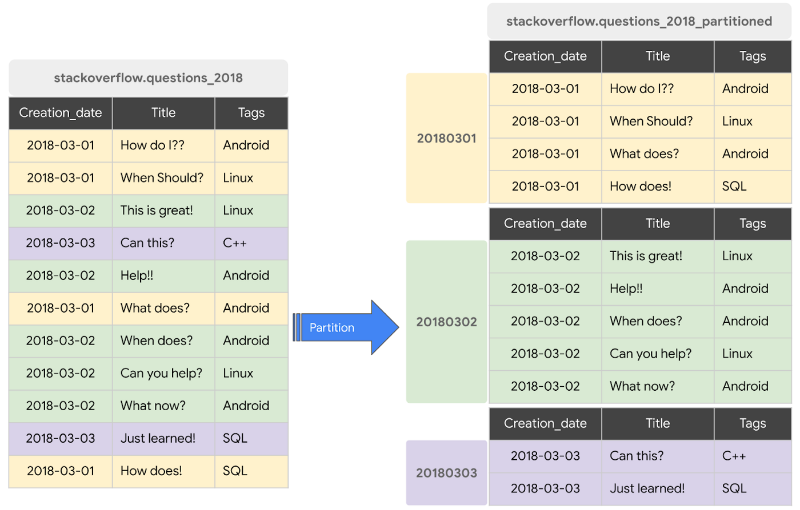
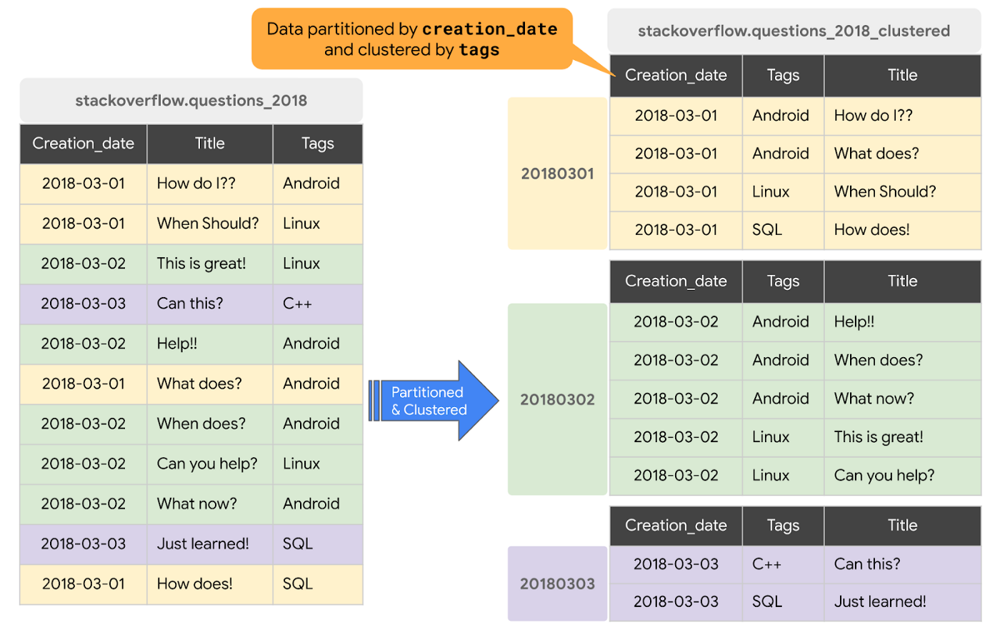
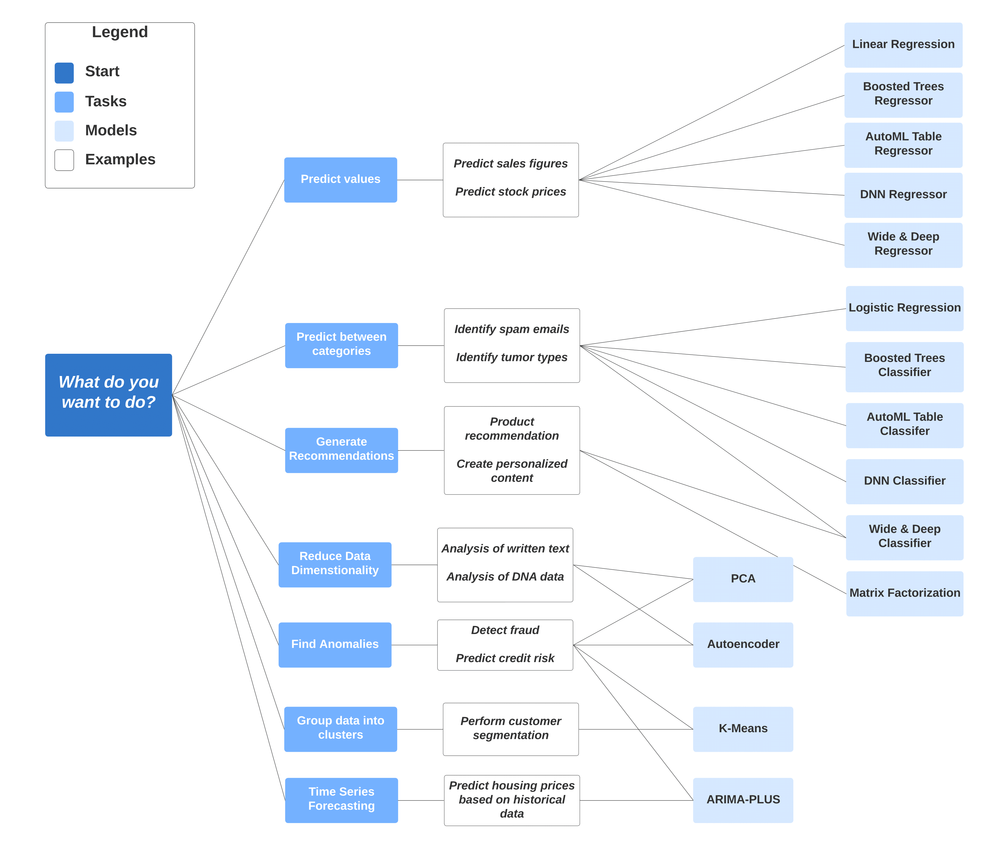

## [Week 3 Official Github](https://github.com/DataTalksClub/data-engineering-zoomcamp/blob/main/03-data-warehouse/README.md): Data Warehouse and BigQuery | [Homework 3](homework.md) | [HW3 Solution](hw3/hw3_solution.md)

### [Video 1: Data Warehouse and BigQuery](https://youtu.be/jrHljAoD6nM)  

**OLTP**: Online Transaction Processing  
**OLAP**: Online Analytical Processing  

|          |   **OLTP**  | **OLAP**   |
|----------|-------------|------------|
| Purpose  |     Buisness operations in real time.        |      Analyzing data for decision making, analytical purposes on large amount of data.      |
| Users    |   Productivity increase for the end user.          |    Increases productivity for the analyst, manager, etc.        |
| Data     |   Updates are fast but small datasets, Normalized data, optimized for write operations.          |     Data is periodically updated in batches, and in large chunks, Denormalized data, optimized for read operations.       |
| User Example   |   Customer online shopping, bank transactions, etc.          |    Data analysis, reporting, business intelligence, etc.        |


**What is Data Warehouse?**  
OLAP solution for reporting and data anlaysis.    
It consists of Raw data, metadata, summary.    
Multiple data source: OPERATING SYSTEM, OLTP DATABASE which report to stagging area before to Data Warehouse.    
Data warehouse can be tranformed to data marts, which is used by analyst for specific purpose.  
Data Scientist look at raw data.  


**Big Query**
Is a serverless, highly scalable, and cost-effective multi-cloud data warehouse designed for business agility. It allows Machine Learning and AI to be integrated with SQL. Flexibity to store the data, it separate the compute and storage.

_Hands on BigQuery_:  

```
Project Name (hybrid-matrix-448616-b9)
├── Dataset Name (demo_dataset)
    └── Table Name (yellow_tripdata_non_partitoned, yellow_tripdata_partitoned, ..)
├── Dataset Name (kestra_zoomcamp)
   └── Table Name (green_tripdata, ....)
```

Disable Cached preference

```sql
-- Query public available table
SELECT station_id, name FROM
    bigquery-public-data.new_york_citibike.citibike_stations
LIMIT 100;
```

**BigQuery Cost**
- On Demand Pricing: amount of data you process. 1TB of data processed is $5. Can give you more slots
- Flat Rate Pricing: Based on number of pre-requested slots. Give you no extra slots.  

In Google BigQuery, **slots** refer to the units of computational capacity that are used to execute queries. Each slot provides a certain amount of CPU and RAM, and is responsible for processing the data necessary to complete a given query. 

Now we will create external table from our dataset that was tranfered to Goggle cloud storage (GCS) by following below commands:

bucket-name:  hybrid-matrix-448616-b9-kestra  
this bucket consists of multiple different csv files for 2019, 2020.  
The uris refers to the path in your GCS bucket.

```sql
-- Creating external table referring to gcs path
CREATE OR REPLACE EXTERNAL TABLE `hybrid-matrix-448616-b9.demo_dataset.external_yellow_tripdata`
OPTIONS (
  format = 'CSV',
  uris = ['gs://hybrid-matrix-448616-b9-kestra/yellow_tripdata_2019-*.csv', 'gs://hybrid-matrix-448616-b9-kestra/yellow_tripdata_2020-*.csv']
);
```
This command would create a table named `external_yellow_tripdata` in the `demo_dataset` dataset in BigQuery in project `hybrid-matrix-448616-b9`. This dataset is not stored inside BigQuery, but rather it is stored in Google Cloud Storage, so it does not have any storage cost associated with it.

```sql
-- Check yello trip data
SELECT * FROM hybrid-matrix-448616-b9.demo_dataset.external_yellow_tripdata limit 10;
```

**Partioning in BigQuery**
This is a way to divide the table into smaller, manageable parts. It can be done by any specific column such as date, integer, etc. It imporves the performance of the query.  




```sql
-- For the below query the data is copied from GCS to BigQuery.
-- Create a non partitioned table from external table
CREATE OR REPLACE TABLE hybrid-matrix-448616-b9.demo_dataset.yellow_tripdata_non_partitoned AS
SELECT * FROM hybrid-matrix-448616-b9.demo_dataset.external_yellow_tripdata;

-- Create a partitioned table from external table, this would have break in the logo
CREATE OR REPLACE TABLE hybrid-matrix-448616-b9.demo_dataset.yellow_tripdata_partitoned
PARTITION BY
  DATE(tpep_pickup_datetime) AS
SELECT * FROM hybrid-matrix-448616-b9.demo_dataset.external_yellow_tripdata;

-- Impact of partition
-- Scanning 1.6GB of data
SELECT DISTINCT(VendorID)
FROM hybrid-matrix-448616-b9.demo_dataset.yellow_tripdata_non_partitoned
WHERE DATE(tpep_pickup_datetime) BETWEEN '2019-06-01' AND '2019-06-30';

-- Scanning ~106 MB of DATA
SELECT DISTINCT(VendorID)
FROM hybrid-matrix-448616-b9.demo_dataset.yellow_tripdata_partitoned
WHERE DATE(tpep_pickup_datetime) BETWEEN '2019-06-01' AND '2019-06-30';

-- Let's look into the partitons
SELECT table_name, partition_id, total_rows
FROM `demo_dataset.INFORMATION_SCHEMA.PARTITIONS`
WHERE table_name = 'yellow_tripdata_partitoned'
ORDER BY total_rows DESC;
```


**Clustering in BigQuery**

Clustering is a way to organize the data in a table based on the contents of one or more columns. It is similar to partitioning, but it is more flexible.It works best with high cardinallity fields. It is used to improve the performance of queries that filter and sort the data based on the clustering columns. Nice [blog](https://cloud.google.com/blog/topics/developers-practitioners/bigquery-explained-storage-overview) and [video](https://www.youtube.com/watch?v=wapi0aR4BZE) by google on partitioning and clustering.  



```sql
-- Creating a partition and cluster table
CREATE OR REPLACE TABLE hybrid-matrix-448616-b9.demo_dataset.yellow_tripdata_partitoned_clustered
PARTITION BY DATE(tpep_pickup_datetime)
CLUSTER BY VendorID AS
SELECT * FROM hybrid-matrix-448616-b9.demo_dataset.external_yellow_tripdata;

-- Query scans 1.1 GB
SELECT count(*) as trips
FROM hybrid-matrix-448616-b9.demo_dataset.yellow_tripdata_partitoned
WHERE DATE(tpep_pickup_datetime) BETWEEN '2019-06-01' AND '2020-12-31'
  AND VendorID=1;

-- Query scans 864.5 MB
SELECT count(*) as trips
FROM hybrid-matrix-448616-b9.demo_dataset.yellow_tripdata_partitoned_clustered
WHERE DATE(tpep_pickup_datetime) BETWEEN '2019-06-01' AND '2020-12-31'
  AND VendorID=1;
```

### [Video 2: Partioning and Clustering](https://youtu.be/-CqXf7vhhDs?list=PL3MmuxUbc_hJed7dXYoJw8DoCuVHhGEQb) 

**BigQuery Partioning**  
You can select columns such as time-unit, ingestion_date, integer_range_partitioning, etc.   
When using Time unit or ingestion time:
- Daily (default): Data is medium size and spread evenyl across days.
- Hourly: Data is large and process data upon each hour, you might need expire partioning stratergy
- Monthly/Yearly: Data is small and spread across months. 
Number of partitions can be _4000_.

**BigQuery Clustering**  
- Clustering depends on the order of columns specified.
- Columns to cluster by: high cardinality, frequently used in filter, sort, join.
- Clustering is done on top of partioning.
- If Data < 1GB, no need to cluster, parition since no benefit.
- You can specify upto 4 columns in clustering, these columns should be top level, non-repeated columns.

| Partioning | Clustering |
|------------|------------|
| Cost benefit known Upfront | Cost benefit unknown |
| You need partioning level management | You need more granularity than partioning |
| Filter or agg on single column | Filter or agg on multiple columns |
| Data is divided into smaller, manageable parts. | Data is organized based on the contents of one or more columns. |
| Max cardinality: 4000 for a column| Can be used for high cardinality column/columns |

**Clustering Over Partitioning**  
- Partioning results in a small amount of data per partition (< 1GB).
- Partion results in large number of partitions beyond 4000.
- If partition result in a lot of modification in partition at a very fast rate. 

**Automatic reclustering**  


### [Video 3: BigQuery Best Practices](https://www.youtube.com/watch?v=k81mLJVX08w&list=PL3MmuxUbc_hJed7dXYoJw8DoCuVHhGEQb&index=29)

**Cost Reduction**  
- Avoid using SELECT *, rather always suggest columns.
- Price your queries before running them.
- Use clustered or partioned tables.
- Use Streaming insert with caution.
- Materialize queries results in stages.
- BQ also caches query results.

**Query Optimization**
- FILTER on partioned column.
- Denormalize data.
- Usage of external data source should be avoided since more cost.
- Avoid oversharding tables.

**Sharding** is a database architecture pattern where large datasets are divided into smaller, more manageable pieces called shards. Each shard is essentially a subset of the database and can be stored on different servers or locations. **Over-sharding** refers to the practice of creating too many shards in a database system, to the point where the benefits of sharding are diminished or negated, and performance or management challenges are introduced.

- Optimize your join patterns.  
Place largest table on the left side of the join, followed by the smaller table since this would be broadcasted to all nodes.

### [Video 4:  Internals of Big Query](https://youtu.be/eduHi1inM4s?list=PL3MmuxUbc_hJed7dXYoJw8DoCuVHhGEQb)


It stores data in a separate storage layer called **Colossus**. It stores in columnar format. This leads to cheap storage.  
Compute takes place in **Dremel**. It is query execution engine, divides the query into tree structure and distribute them to multiple nodes.  

**Columnar Oriented Storage** is the format used by BigQuery to store data. It stores data in columns rather than rows. This allows for faster query performance, as only the columns that are needed for a query are read from disk. It also allows for better compression, as columns tend to have similar data types and values, which can be compressed more efficiently than rows.  

So how do these interact with each other?  
**Jupiter Network** obviates this issue, gives 1TB/s network speed.

The leaf nodes talk to the colossus and the intermediate nodes talk to the leaf nodes.


Google Blogs:  
- [BigQuery explained: An overview of BigQuery's architecture](https://cloud.google.com/blog/products/data-analytics/new-blog-series-bigquery-explained-overview)
- [BigQuery under the hood](https://cloud.google.com/blog/products/bigquery/bigquery-under-the-hood)
- [Google BigQuery Architecture: How It Works](https://panoply.io/data-warehouse-guide/bigquery-architecture/)


### [Video 5:  BigQuery Machine Learning](https://youtu.be/B-WtpB0PuG4?list=PL3MmuxUbc_hJed7dXYoJw8DoCuVHhGEQb)

**ML in BigQuery**
- No need to export data into different system.
- No need for python knowledge.

**Pricing**
- 10GB per month storage free.
- 1TB per month query porcessing free.
- ML create model step: First 10GB free per month.

**Life Cycle for ML**  
- Collect Data
- Data Processing/Feature Engineering
- Data Split
- Model Training
- Model Evaluation
- Model Deployment





We will create a model to predict the tip amount based on the yellow trip data. Refer to this link for [link](https://cloud.google.com/bigquery/docs/preprocess-overview) for feature engineering, which gives you option for [Automatic preprocessing](https://cloud.google.com/bigquery/docs/reference/standard-sql/bigqueryml-auto-preprocessing) and [Manual preprocessing](https://cloud.google.com/bigquery/docs/manual-preprocessing#types_of_preprocessing_functions).

```sql
-- SELECT THE COLUMNS INTERESTED FOR YOU
SELECT passenger_count, trip_distance, PULocationID, DOLocationID, payment_type, fare_amount, tolls_amount, tip_amount
FROM `hybrid-matrix-448616-b9.demo_dataset.yellow_tripdata_partitoned` WHERE fare_amount != 0;

-- CREATE A ML TABLE WITH APPROPRIATE TYPE
CREATE OR REPLACE TABLE `hybrid-matrix-448616-b9.demo_dataset.yellow_tripdata_ml` (
`passenger_count` INTEGER,
`trip_distance` FLOAT64,
`PULocationID` STRING,
`DOLocationID` STRING,
`payment_type` STRING,
`fare_amount` FLOAT64,
`tolls_amount` FLOAT64,
`tip_amount` FLOAT64
) AS (
SELECT passenger_count, trip_distance, cast(PULocationID AS STRING), CAST(DOLocationID AS STRING),
CAST(payment_type AS STRING), fare_amount, tolls_amount, tip_amount
FROM `hybrid-matrix-448616-b9.demo_dataset.yellow_tripdata_partitoned` WHERE fare_amount != 0
);

-- CREATE MODEL WITH DEFAULT SETTING
CREATE OR REPLACE MODEL `hybrid-matrix-448616-b9.demo_dataset.tip_model`
OPTIONS
(model_type='linear_reg',
input_label_cols=['tip_amount'],
DATA_SPLIT_METHOD='AUTO_SPLIT') AS
SELECT
*
FROM
`hybrid-matrix-448616-b9.demo_dataset.yellow_tripdata_ml`
WHERE
tip_amount IS NOT NULL;

-- CHECK FEATURES
SELECT * FROM ML.FEATURE_INFO(MODEL `hybrid-matrix-448616-b9.demo_dataset.tip_model`);

-- EVALUATE THE MODEL
SELECT
*
FROM
ML.EVALUATE(MODEL `hybrid-matrix-448616-b9.demo_dataset.tip_model`,
(
SELECT
*
FROM
`hybrid-matrix-448616-b9.demo_dataset.yellow_tripdata_ml`
WHERE
tip_amount IS NOT NULL
));

-- PREDICT THE MODEL
SELECT
*
FROM
ML.PREDICT(MODEL `hybrid-matrix-448616-b9.demo_dataset.tip_model`,
(
SELECT
*
FROM
`hybrid-matrix-448616-b9.demo_dataset.yellow_tripdata_ml`
WHERE
tip_amount IS NOT NULL
));

-- PREDICT AND EXPLAIN
SELECT
*
FROM
ML.EXPLAIN_PREDICT(MODEL `hybrid-matrix-448616-b9.demo_dataset.tip_model`,
(
SELECT
*
FROM
`hybrid-matrix-448616-b9.demo_dataset.yellow_tripdata_ml`
WHERE
tip_amount IS NOT NULL
), STRUCT(3 as top_k_features));
```

Check this [link](https://cloud.google.com/bigquery/docs/reference/standard-sql/bigqueryml-syntax-create) to understand all different models possible in BigQuery.

```sql
-- HYPER PARAM TUNNING
CREATE OR REPLACE MODEL `hybrid-matrix-448616-b9.demo_dataset.tip_hyperparam_model`
OPTIONS
(model_type='linear_reg',
input_label_cols=['tip_amount'],
DATA_SPLIT_METHOD='AUTO_SPLIT',
num_trials=5,
max_parallel_trials=2,
l1_reg=hparam_range(0, 20),
l2_reg=hparam_candidates([0, 0.1, 1, 10])) AS
SELECT
*
FROM
`hybrid-matrix-448616-b9.demo_dataset.yellow_tripdata_ml`
WHERE
tip_amount IS NOT NULL;
```


### [Video 6:  BigQuery Machine Learning Deployment](https://youtu.be/BjARzEWaznU?list=PL3MmuxUbc_hJed7dXYoJw8DoCuVHhGEQb)

## Model deployment
[Tutorial](https://cloud.google.com/bigquery-ml/docs/export-model-tutorial)
### Steps
- gcloud auth login
- bq --project_id taxi-rides-ny extract -m nytaxi.tip_model gs://taxi_ml_model/tip_model
- mkdir /tmp/model
- gsutil cp -r gs://taxi_ml_model/tip_model /tmp/model
- mkdir -p serving_dir/tip_model/1
- cp -r /tmp/model/tip_model/* serving_dir/tip_model/1
- docker pull tensorflow/serving
- docker run -p 8501:8501 --mount type=bind,source=`pwd`/serving_dir/tip_model,target=
  /models/tip_model -e MODEL_NAME=tip_model -t tensorflow/serving &
- curl -d '{"instances": [{"passenger_count":1, "trip_distance":12.2, "PULocationID":"193", "DOLocationID":"264", "payment_type":"2","fare_amount":20.4,"tolls_amount":0.0}]}' -X POST http://localhost:8501/v1/models/tip_model:predict
- http://localhost:8501/v1/models/tip_model