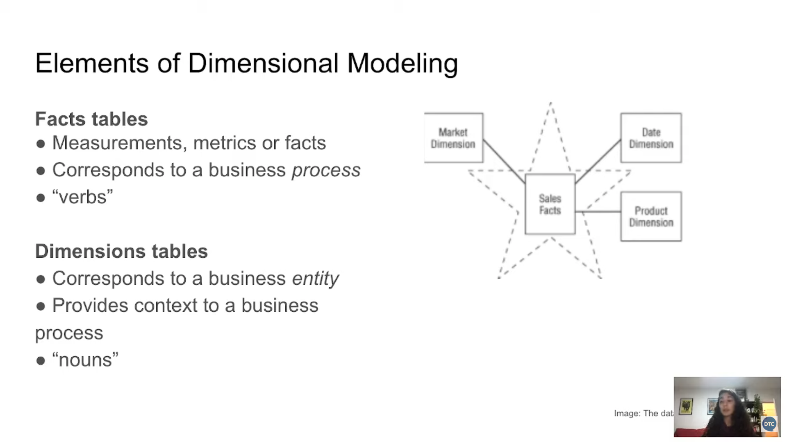
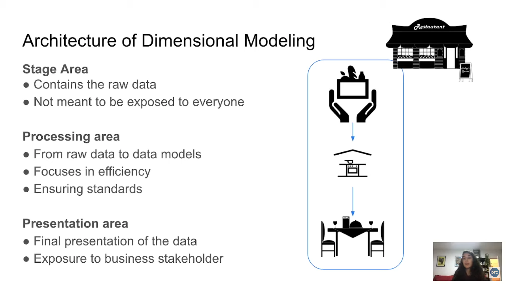

## [Week 3 Official Github](https://github.com/DataTalksClub/data-engineering-zoomcamp/tree/main/04-analytics-engineering): Analytics Engineering | [Homework 4](homework.md) | [HW4 Solution](hw4/hw4_solution.md)

**Pre-requisites:**
- You could refer to this [dbt_cloud_setup.md](dbt_cloud_setup.md) for setting up dbt cloud with bigquery or refer to this [guide](https://docs.getdbt.com/guides/bigquery?step=1). I have the same project_id but created a new dataset id: `module4`, and new service account key with only bigquery data editor, and bigquery job user roles for connecting to dbt cloud.  
- I have also connected my github repo to the dbt cloud and referenced folder `week_4` in the dbt cloud.
- We would need 2019, 2020 yellow taxi and green taxi data which we already have in our GCP bucket name `hybrid-matrix-448616-b9-kestra` in csv format. Use the below sql command to transfer data from GCP bucket to BigQuery dataset `module4`:

```sql
-- To transfer yellow trip data for the year 2019, 2020 as external table.
CREATE OR REPLACE EXTERNAL TABLE `hybrid-matrix-448616-b9.module4.external_yellow_tripdata`
OPTIONS (
  format = 'CSV',
  uris = ['gs://hybrid-matrix-448616-b9-kestra/yellow_tripdata_2019-*.csv', 'gs://hybrid-matrix-448616-b9-kestra/yellow_tripdata_2020-*.csv']
);

-- To make internal table from the external table.
CREATE OR REPLACE TABLE `hybrid-matrix-448616-b9.module4.yellow_tripdata` AS
SELECT * FROM `hybrid-matrix-448616-b9.module4.external_yellow_tripdata`;

-- remove the external table 
DROP TABLE module4.external_yellow_tripdata

-- To transfer green trip data for the year 2019, 2020 as external table.
CREATE OR REPLACE EXTERNAL TABLE `hybrid-matrix-448616-b9.module4.external_green_tripdata`
OPTIONS (
  format = 'CSV',
  uris = ['gs://hybrid-matrix-448616-b9-kestra/green_tripdata_2019-*.csv', 'gs://hybrid-matrix-448616-b9-kestra/green_tripdata_2020-*.csv']
);

-- To make internal table from the external table.
CREATE OR REPLACE TABLE `hybrid-matrix-448616-b9.module4.green_tripdata` AS
SELECT * FROM `hybrid-matrix-448616-b9.module4.external_green_tripdata`;

-- remmove the external table
DROP TABLE module4.external_green_tripdata
```

### [Video 1: Analytics Engineering Basics](https://youtu.be/uF76d5EmdtU?list=PL3MmuxUbc_hJed7dXYoJw8DoCuVHhGEQb)


Roles in Data Team:
- Data Engineer: Maintain and prepare infrastructure the data team needs.
- _Analytics Engineer: Build the data pipelines and data models that the data analyst needs._ 
- Data Analyst: Use data to answer questions and solve the problems. 

Data Storing: Cloud Storage, BigQuery, Redshift, Snowflake, etc.  
Data Modelling: tools like dbt or Dataform.  
Data Visualization: BItools like Looker, Tableau, PowerBI, etc.  


**Data Modelling Concepts:**
- ETL: Extract, Transform, Load
  - This take longer time to process the data.
  - But the data would be more clean and structured.
  - Higher Storage and compute cost
- ELT: Extract, Load, Transform
  - Faster and flexible since we already have data loaded.
  - Lower storage and compute cost since DWH has more compute power.


**Kimballs Dimensional Modelling:**
- Objective:
  - Deliver data understandable by business users.
  - Delivr fast query performance.
- Approach:
  - Priortise user understandability and query performance over non redundant data (3NF).
- Other Approaches:
  - Data Vault: Focus on auditability and traceability.
  - Bill Inmon's Corporate Information Factory: Focus on data integration and consistency.


**Elements of Dimensional Modelling:**  
- Fact Table: Contains the metrics or facts.
- Dimension Table: Contains the context or dimensions.




**Architecture of Dimensional Modelling:**  
- Staging Area:
  - Raw data from source systems.
- Prcoessing Area:
  - Cleaned and transformed data.
- Presentation Area:
  - Data models for business users.  




### [Video 2: What is dbt?](https://youtu.be/gsKuETFJr54?list=PL3MmuxUbc_hJed7dXYoJw8DoCuVHhGEQb)

dbt is transfromation workflow tool that allows anyone that knwos SQL to deploy analytics code following software engineering best practices.

