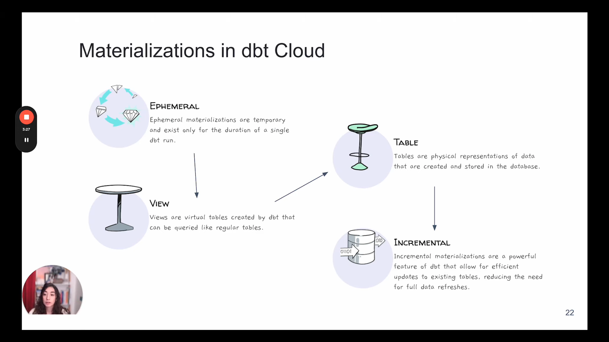

## [Week 4 Official Github](https://github.com/DataTalksClub/data-engineering-zoomcamp/tree/main/04-analytics-engineering): Analytics Engineering | [Homework 4](homework.md) | [HW4 Solution](hw4/hw4_solution.md)

**Pre-requisites:**
- You could refer to this [dbt_cloud_setup.md](dbt_cloud_setup.md) for setting up dbt cloud with bigquery or refer to this [guide](https://docs.getdbt.com/guides/bigquery?step=1). I have the same project_id but created a new dataset id: `module4`, and new service account key with only bigquery data editor, and bigquery job user roles for connecting to dbt cloud.  
- I have also connected my github repo to the dbt cloud and referenced folder `week_4` in the dbt cloud.
- We would need 2019, 2020 yellow taxi and green taxi data which we already have in our GCP bucket name `hybrid-matrix-448616-b9-kestra` in csv format. Use the below sql command to transfer data from GCP bucket to BigQuery dataset `module4`:

🚨🚨🚨 Big Query notation:  
- The **project name** can be considered analogous to a **database**.
- The **dataset ID** serves as the **schema** within that project.

```sql
-- To transfer yellow trip data for the year 2019, 2020 as external table.
CREATE OR REPLACE EXTERNAL TABLE `hybrid-matrix-448616-b9.module4.external_yellow_tripdata`
OPTIONS (
  format = 'CSV',
  uris = ['gs://hybrid-matrix-448616-b9-kestra/yellow_tripdata_2019-*.csv', 'gs://hybrid-matrix-448616-b9-kestra/yellow_tripdata_2020-*.csv']
);

-- To make internal table from the external table.
CREATE OR REPLACE TABLE `hybrid-matrix-448616-b9.module4.yellow_tripdata` AS
SELECT * FROM `hybrid-matrix-448616-b9.module4.external_yellow_tripdata`;

-- remove the external table 
DROP TABLE module4.external_yellow_tripdata

-- To transfer green trip data for the year 2019, 2020 as external table.
CREATE OR REPLACE EXTERNAL TABLE `hybrid-matrix-448616-b9.module4.external_green_tripdata`
OPTIONS (
  format = 'CSV',
  uris = ['gs://hybrid-matrix-448616-b9-kestra/green_tripdata_2019-*.csv', 'gs://hybrid-matrix-448616-b9-kestra/green_tripdata_2020-*.csv']
);

-- To make internal table from the external table.
CREATE OR REPLACE TABLE `hybrid-matrix-448616-b9.module4.green_tripdata` AS
SELECT * FROM `hybrid-matrix-448616-b9.module4.external_green_tripdata`;

-- remmove the external table
DROP TABLE module4.external_green_tripdata
```

### [Video 1: Analytics Engineering Basics](https://youtu.be/uF76d5EmdtU?list=PL3MmuxUbc_hJed7dXYoJw8DoCuVHhGEQb)


Roles in Data Team:
- Data Engineer: Maintain and prepare infrastructure the data team needs.
- _Analytics Engineer: Build the data pipelines and data models that the data analyst needs._ 
- Data Analyst: Use data to answer questions and solve the problems. 

Data Storing: Cloud Storage, BigQuery, Redshift, Snowflake, etc.  
Data Modelling: tools like dbt or Dataform.  
Data Visualization: BItools like Looker, Tableau, PowerBI, etc.  


**Data Modelling Concepts:**
- ETL: Extract, Transform, Load
  - This take longer time to process the data.
  - But the data would be more clean and structured.
  - Higher Storage and compute cost
- ELT: Extract, Load, Transform
  - Faster and flexible since we already have data loaded.
  - Lower storage and compute cost since DWH has more compute power.


**Kimballs Dimensional Modelling:**
- Objective:
  - Deliver data understandable by business users.
  - Delivr fast query performance.
- Approach:
  - Priortise user understandability and query performance over non redundant data (3NF).
- Other Approaches:
  - Data Vault: Focus on auditability and traceability.
  - Bill Inmon's Corporate Information Factory: Focus on data integration and consistency.


**Elements of Dimensional Modelling:**  
- Fact Table: Contains the metrics or facts.
- Dimension Table: Contains the context or dimensions.


**Architecture of Dimensional Modelling:**  
- Staging Area:
  - Raw data from source systems.
- Prcoessing Area:
  - Cleaned and transformed data.
- Presentation Area:
  - Data models for business users.  


### [Video 2: What is dbt?](https://youtu.be/gsKuETFJr54?list=PL3MmuxUbc_hJed7dXYoJw8DoCuVHhGEQb)

**dbt** is transfromation workflow tool that allows anyone that knwos SQL to deploy analytics code following software engineering best practices like modularity, portability, CI/CD, and documentation.

Each **model** is:
- A SQL query that defines a dataset.
- Select statement, no DDL or DML.
- A file dbt will compile and run in our DWH.

We cab use dbt by **dbt Core** which have CLI and **dbt Cloud** which is a SaaS platform, consisting a cloud IDE.

I have used versoin A where I have my data in BigQuery and dbt cloud IDE. 


### [Video 3: Start Your dbt Project BigQuery and dbt Cloud](https://youtu.be/J0XCDyKiU64?list=PL3MmuxUbc_hJed7dXYoJw8DoCuVHhGEQb)

I have connected via github and used subdirectory `week_4/dbt_cloud` for all the dbt cloud IDE work and create a new branch named `nd_de`.


### [Video 4: Build the First dbt Models](https://www.youtube.com/watch?v=ueVy2N54lyc&list=PL3MmuxUbc_hJed7dXYoJw8DoCuVHhGEQb&index=37&pp=iAQB)

**Models**
- Models are .sql files that live in the models folder.
- Models are simply written as select statements - there is no DDL/DML that needs to be written around this. This allows the developer to focus on the logic.
- In the Cloud IDE, the Preview button will run this select statement against your data warehouse. The results shown here are equivalent to what this model will return once it is materialized.
- After constructing a model, dbt run in the command line will actually materialize the models into the data warehouse. The default materialization is a view.
- The materialization can be configured as a table with the following configuration block at the top of the model file:
```jinja
{{
    config(materialized='table')
}}
```
- The materialization can be configured as a view with the following configuration block at the top of the model file:
```jinja
{{
    config(materialized='view')
}}
```
- When dbt run is executing, dbt is wrapping the select statement in the correct DDL/DML to build that model as a table/view. If that model already exists in the data warehouse, dbt will automatically drop that table or view before building the new database object. *Note: If you are on BigQuery, you may need to run dbt run --full-refresh for this to take effect.
- The DDL/DML that is being run to build each model can be viewed in the logs through the cloud interface or the target folder.

Materialization:  
- Ephermal: Do not materialize in the data base, similar to CTE. Temporary table, used for testing.
- View: Is going to be materialized as a view in the database.
- Table: Is going to be materialized as a table in the database.
- Incremental: Is going to be materialized as a table in the database, but only the new data will be added to the table.
  



- **Sources**: Way to refer to raw tables that exist in our datawarehouse.  
- **Staging Models**: First step in transformation, where we clean and transform the data.
- **Intermediate Models**: Build upon staing models
- **Fact Models**: Skinny tables, very long tables, event already happened or will happen over time.
- **Dimension Models**: Wide tables, descriptive, static, not changing frequently. Customers, Users, it does not update very frequently.


**Seeds:**
- CSV file stored in our repo under the seed folder.
- Benefit of version of control.
- stays inside the seed folder.
- Run with `dbt seed -s file_name`.
